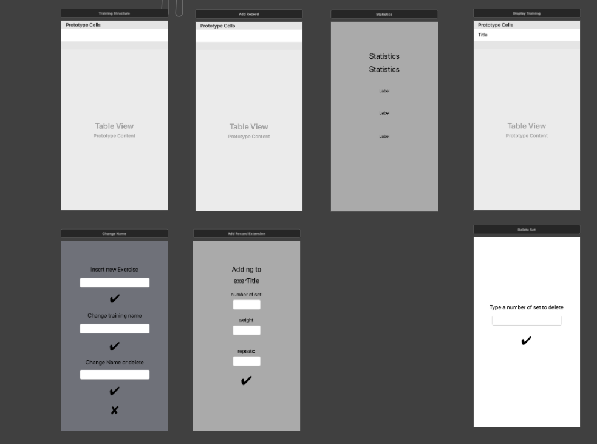

# Training-App
Application for saving training scores, written in Swift, based on Storyboard and SQLite. 

## Table of contents
* [Technologies](#Technologies)
* [Scenes Preview](#ScenesPreview)

## Technologies
* Swift
* Storyboard
* SQLite
* FMDB

## Scenes_Preview
 

